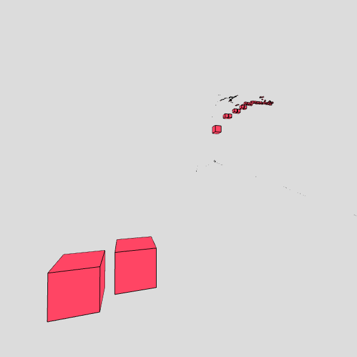

# MonoSlam

MonoSlam a toy implementation of monocular SLAM written in NodeJs.

MonoSlam is a feature based SLAM that uses OpenCV as feature extractor and matcher. As of now, this project is focused on getting the 3D cordinates of all the matched features, sadly at the moment i wasan't able to find a good 3D plotter in sdl (Nodejs).

## How does it work

1. Find a good video where you want to apply SLAM.
1. Let the algorithm find the beast matching features and triangulate them to obtain the 3D global coords.
1. ??? 
1. profit.

## Getting Started

This project is intended to be used with the latest Active LTS release of Node.js.

1. Install NodeJs
1. Install npm
1. Download the source code of this project as a zip or with git
1. open a terminal and navigate to the project 
1. execute "yarn"
1. run "yarn build" if it fails modify signature of OpenCV triangulatePoints in (Mat.d.ts) adding a new param at position 0 with type Mat, leaving the rest as it was.
1. run "yarn start", 
1. If the result is not as desirable as wanted, adjust the distance of the focal point, or change the number of MAX_FEATURES to detect.

## Available Scripts

+ `clean` - remove coverage data, Jest cache and transpiled files,
+ `build` - transpile TypeScript to ES6,
+ `start` - runs ImageJ with the inputs given in the .env file,
+ `build:watch` - interactive watch mode to automatically transpile source files,
+ `lint` - lint source files and tests,
+ `test` - run tests,
+ `test:watch` - interactive watch mode to automatically re-run tests
+ `test:debug` - to debug using google's chromium console.

## Acknowledgements

Following as guide George's live attemp to code SLAM: https://github.com/geohot/twitchslam

## License
Licensed under the APLv2. See the [LICENSE](https://github.com/jsynowiec/node-typescript-boilerplate/blob/master/LICENSE) file for details.
